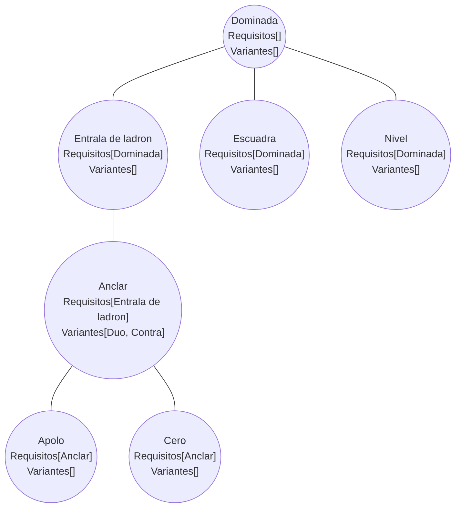

# Mapa de Movimientos

Nomenclatura de movimientos con las relaciones actuales de la base de datos:
las **líneas continuas** representan las **evoluciones** (tabla `evoluciones`) y las **variantes** se listan dentro del array del nodo base (tabla `variaciones`).

